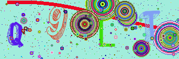

# package mycaptcha

a captcha library writen in golang

### installation

`go get github.com/diguacheng/mycaptcha/`

### examples:





### feature:

- 支持png，jpeg，gif等多种图片格式
- 支持base64、base64url编码
- 使用简单，只需调用一行函数
- 支持定制化，自定义验证码图片

### usage

**注意**：使用前需要先导入字体库的字体，可通过函数`mycaptcha.LoadFonts(fontfolder)`实现。

以下具体使用可参考example文件夹

#### 1. `func GetSingleCaptcha(width, height, n int) (pth, text string)`

生成png格式的验证码图片并存储，返回该图片的保存路径和验证码文本

参数：

- width 图片长度
- height 图片高度
- n 验证码字符的个数
- pth 生成的验证码图片的路径
- text 验证码文本

#### 2.`func GetCaptchaBase64(width, height, n int) (base64Str, text string)`

生成png格式的验证码图片并将其编码成base64字符串，返回该图片的base64编码和验证码文本

参数：

- width 图片长度
- height 图片高度
- n 验证码字符的个数
- base64Str 生成图片的base64编码
- text 验证码文本

HTML内联插入图片：``

#### 3.定制生成验证码

以`func GetSingleCaptcha(width, height, n int) (pth, text string)`为例：

```go
func GetSingleCaptcha(width, height, n int) (pth, text string) {
    // 创建验证码图片
	CaptchaImage := NewCaptchaImage(width, height, n, GetRandLightColor())
    // 画噪音
	CaptchaImage.DrawNoise()
   	// 画曲线干扰线
	CaptchaImage.DrawSinLine()
    // 画圆形干扰线,参数为圆的最大半径和圆的个数
	CaptchaImage.DrawCirlce(height/3,width/height*3)
    // 画验证码文本，验证码文本在NewCaptchaImage()函数内生成
	CaptchaImage.DrawText()
    // 画圆形干扰线
	CaptchaImage.DrawCirlce(width/100,100)
    // 保存验证码 参数为保存的地址，"."代表当前文件夹，format为保存格式，0：png 1：jpeg；2:gif,默认png
	pth,err := CaptchaImage.SaveImage(".", 0)
	if err!=nil{
		return
	}
    text = CaptchaImage.GetText()
	return pth,text
}
```

实际上就是调用一系列函数，自主决定验证码图片的大小，验证码个数，干扰线等。


### other

字体保存在文件夹fonts